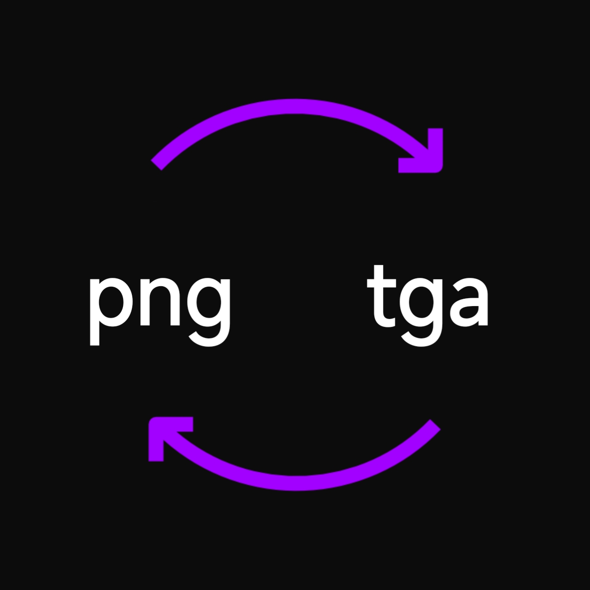

# Image Converter

A tool for converting image formats, supporting 176 formats via ImageMagick

  
  
  

## Supported Formats

### Image
APNG, ART, ASHLAR, AVS, BMP, BMP2, BMP3, CAL, CALS, CIN, CUR, DCX, DDS, DPX, DXT1, DXT5, EPT, EPT2, EPT3, FARBFELD, FAX, FF, FITS, FL32, FTS, G3, G4, GIF, GIF87, HDR, HRZ, ICB, ICN, ICO, ICON, IPL, JNG, JPE, JPEG, JPG, JPS, JXL, MAP, MIFF, MNG, MONO, MPC, OTB, PALM, PCD, PCDS, PCL, PCT, PCX, PDB, PGX, PICON, PICT, PJPEG, PNG, PNG00, PNG24, PNG32, PNG48, PNG64, PNG8, PSB, PSD, QOI, RAS, RGF, SF3, SGI, SUN, TGA, VDA, VICAR, VID, VIFF, VIPS, VST, WBMP, WEBP, WPG, X, XBM, XPM, XV, XWD

### Raw
BAYER, BAYERA, BGR, BGRA, BGRO, CMYK, CMYKA, GRAY, GRAYA, PAL, RGB, RGBA, RGBO, UYVY, YCBCR, YCBCRA, YUV

### Text
BRAILLE, BRF, CLIP, FTXT, HISTOGRAM, HTML, HTM, INFO, INLINE, ISOBRL, ISOBRL6, JSON, KERNEL, MASK, MATTE, SHTML, SPARSE-COLOR, STRIMG, THUMBNAIL, TXT, UBRL, UBRL6, UIL, YAML

### Video
FLV, M2V, M4V, MKV, MOV, MP4, MPEG, MPG, WEBM, WMV

### Other
AAI, ASE, ASEPRITE, CIP, EPS2, EPS3, MAT, MTV, MVG, PAM, PBM, PFM, PGM, PHM, PNM, PPM, PS2, PS3, SIX, SIXEL

---

  
  

